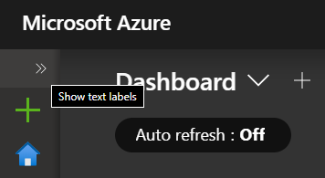

# Lab01 - Azure Portal and Navigation

This lab provides a hands-on experience with Azure Portal and gives a quick overlook of portal navigation.

# Azure Foundations & Management
## Getting started with the Azure portal

# Overview
Microsoft Azure is a multi-tenant, public cloud computing platform. It is designed for building, deploying, and managing applications and services through a global network of Microsoft-managed datacenters. It provides SaaS (Software as a Service), PaaS (Platform as a Service), and IaaS (Infrastructure as a Service) and supports many different programming languages, tools, and frameworks, including both Microsoft and third-party software and systems.

In this lab, we will be focusing on the Azure foundation. The following topics/objectives will be covered:
* Portals and Navigation
* Accounts, Subscriptions, and Usage
* Classic vs. Resource Manager

# Portals and Navigation

* The portal is a central place to deploy and manage Azure resources. It is a comprehensive marketplace that allows the user to browse through thousands of items from Microsoft (and others) that can be purchased and/or provisioned on the Azure cloud platform.
* The portal provides a unified and scalable browser experience that makes it easy to find resources that can be used to perform various management operations.
* The portal contains management web pages (referred to as **blades**) including settings, actions, billing information, health monitoring, usage data, and other configuration options that the user can manage.
* The portal provides a customizable experience that allows the user to create a dashboard that will display information that is important to the individual user. Some settings and options (which are displayed as tiles ) that can be displayed on the dashboard can include:
  * **All resources** (displays deployed resources in all subscriptions by default)
  * **Service health** (displays the availability status of the Azure datacenters)
  * **Help + support** (Log support tickets and connect to the support community)
  * **Marketplace** (browse Microsoft and third-party offerings to purchase and/or provision in Azure)
  * **Settings** (set default preferences for dashboard color, subscription filter, language settings, and more)

### Capabilities or components used in this scenario:
* Azure: Azure Resource Manager (ARM)

# Scenario 1 - Navigation
Perform the following steps to get familiar with navigating the Azure portal.

Sign in to the Azure portal at https://portal.azure.com

1. In the **Email** or phone field, enter email provided by instructor and click Next
2. In the **Password** field, enter password provided by instructor  and click Sign in
3. In the **Stay signed in?** window, click **No**
4. If a **Welcome to Microsoft Azure** popup window appears, click **Maybe Later** to skip the tour

# If your portal is in non-English language
1. Click on settings icon  and go to **Language and region** tab
2. Change language to **English**
3. Click **Apply**

# Home page and tiles
## Part A - Settings and notifications
1. Click on **menu** icon  to show pop up menu
2. Click **Dashboard** on the left pane of the portal
3. At the top of the **Dashboard** page, click on the **Fullscreen** button to change the page to the fullscreen mode. Press the **Esc** key on your keyboard to exit fullscreen mode
4. In the top right-hand corner, click on **Settings** 
5. Change default view from **Home** to **Dashboard**
6. Change menu mode from **Flyout** to **Docked**
7. Choose a different theme color, and click **Apply**
8. In the top right-hand corner, click on **Notifications** 
9. Close the **Notifications** blade
> **Note**: You can review the status of any activity performed within the Azure portal .

## Part B - Tiles
You will notice several tiles on the **Dashboard** page such as All resources, Get started, Marketplace, and Service health. Just like your desktop icons, these tiles provide quick access to Azure resources and different parts of the portal. Perform the following steps to observe the tile functions:
1. In the menu on the left side (referred to as the **Favorites** menu), click the **Show text label** button  and then click on **Azure Active Directory**
2. Close the **Azure Active Directory** blade
3. On the **Dashboard** page, click the **Show text label** button to expand the **Favorites** menu, if it is collapsed

   

4. Click on **All resources** to review the list of resources used for this lab
5. Close the **All resources** blade
6. Click **Service Health** tile on the **Dashboard**
7. Click on Health history, select an option in the Time range dropdown menu to view all past issues for that time period
8. Close the **Service Health** blade
9. Click on **Monitor** in the **Favorites** menu
10. Click on **Activity log**
11. Select an option in the **Timespan** dropdown menu and click **Apply**, Click **Event severity** and choose all the available options, click **Apply**
12. Close the **Activity** log blade
13. Click the **Marketplace** tile and note the different offerings and categories 
14. Close the **Marketplace** blade
15. Click Help + support at the bottom of the **Favorites** menu and note the links to different support resources
16. On the **Help + support** blade, click **New support request** to open the **New support request** blade which you can use to create a support ticket
17. Close the **New support request** blade

> This completes this scenario. 

# Scenario 2 - Pinning a resource group and using the Azure calculator
1. In the **Favorites** menu, click **Resource groups**
2. On the **Resource groups** blade, click the resource group from the list
3. Click on the pin  in the upper right corner of the **Resource group** blade to pin the resource group to your **Dashboard** page
   > You will now navigate to the Azure Pricing calculator to get cost estimates for a Virtual machine and Storage account.
4. Click [here to navigate to the Azure Pricing calculator](https://azure.microsoft.com/en-us/pricing/calculator/)
5. In the **Products** window, click on **Compute**
6. In the **Compute** menu, click **Virtual Machines**
7. In the **Products** window, click **Storage**
8. In the **Storage** menu, click the first **Storage** option
9. Scroll down to **Virtual Machines** item window , change the **REGION** from **West US** to **East US**
10. Click the **OPERATING SYSTEM** dropdown menu to review the different operating system (OS) options, then select **Windows**
11. Verify the **PRICING TIER** is set to **Standard**
12. Click the **INSTANCE** dropdown menu to see the different VM size options, then select **F1: 1 cores, 2 GB RAM, 16 GB Temporary storage, $0.0957/hour**
13. Change the number of **Virtual Machines** from 1 to 5 under the **Billing Options**
    > Note Virtual machines are priced by the hour. If you adjust the hours below 744 (which is a full month), the cost will decrease.
14. In the **Storage** item window, change the **REGION** from **West US** to **East US**
15. Click the **TYPE** dropdown menu to see the available options, then select **Block Blob Storage**
16. Click the **REDUNDANCY** dropdown menu, then select different options to see how the cost is impacted
17. Once you have your configuration done, you can save it by clicking the **Export link**.

> This completes the lab.

# Lab Conclusion:
This lab provided an overview of the ARM portal to familiarize you with the basic elements of the portal. The links below provide further information:
* To learn more about the ARM portal, click the following link: [Azure Resource Manager Portal](https://azure.microsoft.com/en-us/features/azure-portal/)
* The above scenarios were completed using the ARM portal. However, there are still some management activities that can only be performed in the Azure Service Manager (ASM) portal, also known as the "Classic" portal. For a comparison of ASM arm ARM, click the following link: [ASM vs ARM](https://docs.microsoft.com/en-us/azure/azure-resource-manager/resource-manager-deployment-model)
* For the most current service/solution portal availability information, click the following link [Azure portal availability chart](https://azure.microsoft.com/en-us/features/azure-portal/availability/)