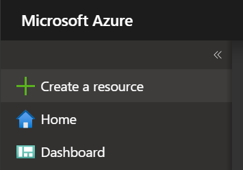
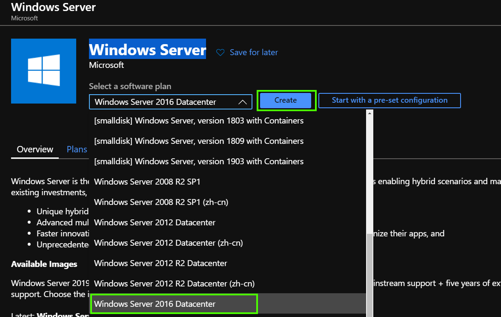

# Lab02 - Virtual Machines

This lab aims to provide a hands-on experience in deploying virtualized operating systems using [Azure Virtual Machines](https://docs.microsoft.com/en-us/azure/virtual-machines/windows/) **(VM)**

## About the exercise

The purpose of the exercise is to demonstrate the deployment of a windows virtual machine and enabling IIS web server with simple hello world application.

# Scenario 1 - provisioning of Windows Virtual Machine

1. Azure Portal
    1. Sign in to the portal using the provided credentials.
2. Create the Azure Virtual Machine by searching Marketplace
    
    1. Select **Create a resource**
    2. Search the Marketplace for **Windows Server**
    3. Click **Create**
3. Configure Virtual Machine 
    
    - **Resource group**: Select your resource group
    - **Container name**: set to **vmdemo**
    - **Region**: pick a region, preferably North Europe
    - **Image type**: set to **Windows Server 2016 Datacenter**
    - **Size**: set to **DS2 v2**. 
    - **Administrator account username** - pick admin username, this will be used to log into Virtual Machine
    - **Administrator account password** - pick admin password, this will be used to log into Virtual Machine
    > Make sure to write this username and password down.
    - **Public inbound ports**: ensure **Allow selected ports** is selected.
    - **Select inbound ports**: and check **HTTP**, **HTTPS** and **RDP**

... work in progress