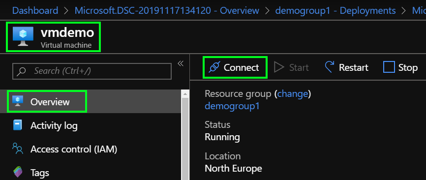
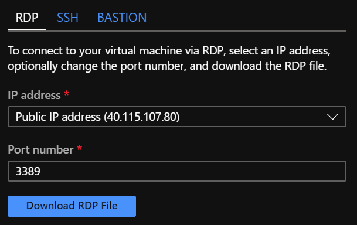
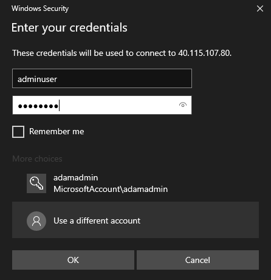
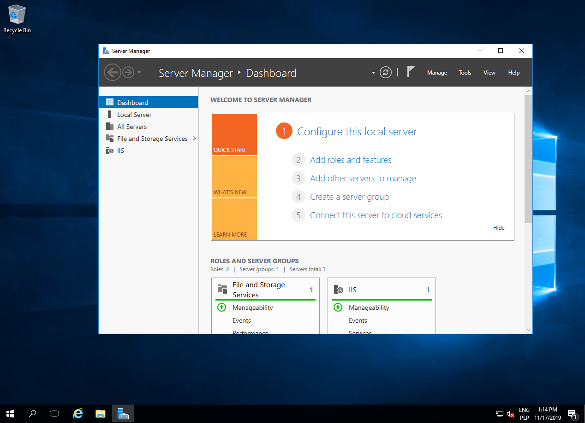
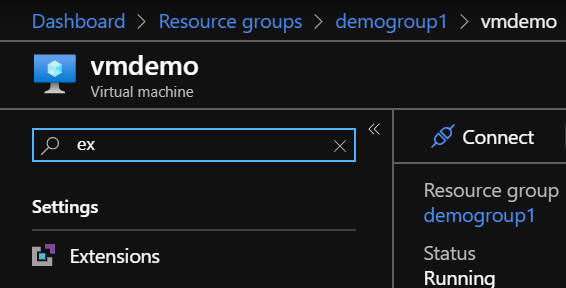
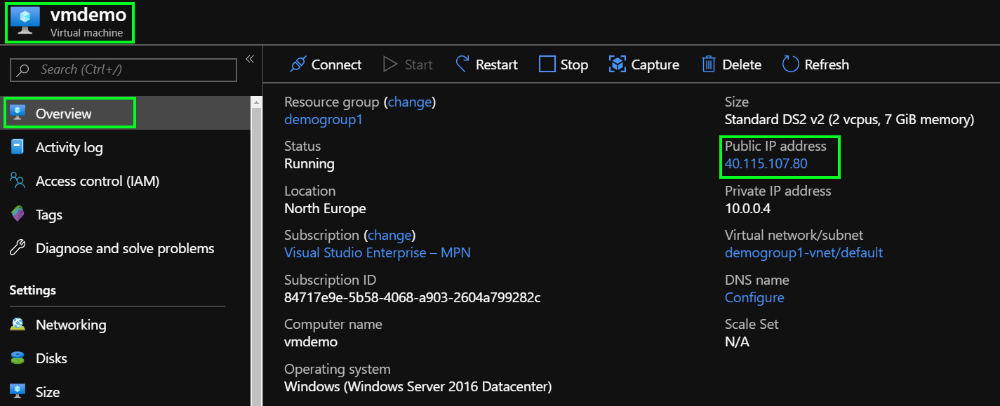

# Lab02 - Virtual Machines

This lab aims to provide a hands-on experience in deploying virtualized operating systems using [Azure Virtual Machines](https://docs.microsoft.com/en-us/azure/virtual-machines/windows/) **(VM)**

## About the exercise

The purpose of the exercise is to demonstrate the deployment of a windows virtual machine and enabling IIS web server with simple hello world application.

# Scenario 1 - provisioning of Windows Virtual Machine

1. Azure Portal
    1. Sign in to the portal using the provided credentials.
2. Create the Azure Virtual Machine by searching Marketplace
    
    1. Select **Create a resource**
    2. Search the Marketplace for **Windows Server**
    3. Click **Create**
3. Configure Virtual Machine 
    
    - **Resource group**: Select your resource group
    - **Container name**: set to **vmdemo**
    - **Region**: pick a region, preferably North Europe
    - **Image type**: set to **Windows Server 2016 Datacenter**
    - **Size**: set to **DS2 v2**. 
    - **Administrator account username** - pick admin username, this will be used to log into Virtual Machine
    - **Administrator account password** - pick admin password, this will be used to log into Virtual Machine
    > Make sure to write this username and password down.
    - **Public inbound ports**: ensure **Allow selected ports** is selected.
    - **Select inbound ports**: and check **HTTP**, **HTTPS** and **RDP**
    - Hit **create**
4. Wait for deployment to finish 
5. Look around the Virtual Machine and explore what do you have in your resource group

# Scenario 2 - Connect with Remote Desktop Services

1. Open **Overview** tab and click **Connect**
    
2. And click **Download** button and open it
    
3. Enter Admin user credentials used to create VM 
    
4. Check remote desktop 
    
5. Disconnect from the server

# Scenario 3 - Install VM extension with Web Server

> Before begining download **ConfigureWebServer.ps1.zip** from Mod2 folder.

1. Open **Virtual Machine**
2. Navigate to **Extensions** blade
    
3. Click **Add** to add new extension called **PowerShell Desired State Configuration** 
     
4. Click Create
5. Fill in the form
   1. **Configuration Modules or Script** select **ConfigureWebServer.ps1.zip** from your drive
   2. **Module-qualified Name of Configuration** type in **ConfigureWebServer.ps1\DeployWebPage**
   3. **Version** set to **2.21**
5. Wait for deployment to Finish
6. Go to **Overview** tab and copy public IP of your Virtual Machine 
    
7. Paste it in the browser and check the result!
    

# Clean up
Now simply delete resource LAB02 resource group.

# Lab Conclusion:
This lab provided an overview of the Virtual Machines to familiarize you with the basic elements of the virtual machines. The links below provide further information:
* To learn more about the Virtual Machines, click the following link: [Azure Virtual Machines](https://docs.microsoft.com/en-us/azure/virtual-machines/windows/)