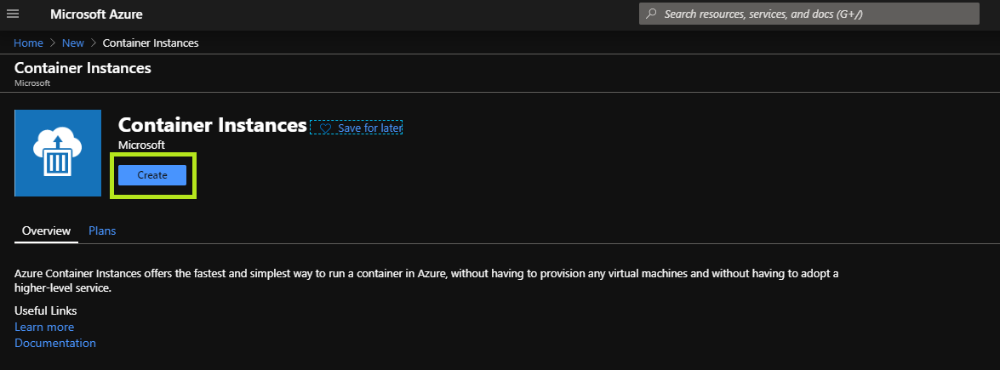

# Lab03 - Azure Container Instances

This lab aims to provide a hands-on experience in deploying a container instance using the [Azure Container Instances](https://azure.microsoft.com/en-us/services/container-instances/) **(ACI)**

## About the exercise

The purpose of the exercise is to demonstrate the deployment of a linux container, containing a simple NodeJS web application, using the ACI.

> **Local test (optional)**
>
> If you have docker installed, you can execute the following command from your preferred command line:
> - `docker run -it --rm -p 8080:80 mcr.microsoft.com/azuredocs/aci-helloworld:latest`
>
> Next, you can access `http://localhost:8080` using your preferred browser to verify that the container is running

## Deployment

### Azure Portal (Manual)

> This method aims to deploy an ACI instance using the Azure Portal

#### Azure Portal

- Sign in to the portal using the provided credentials.
#### Resource Group

- The resource group dedicated for this lab is: `AZ900_user[i]_LAB03_RG`

#### Create the Azure Container Instance

- Select `Create a resource`.
- Search the Marketplace for `Container Instances`.

- Click `Create`.

#### Configure ACI Basics

- **Resource group**: Ensure the `AZ900_user[i]_LAB03_RG` resource group is selected.
- **Container name**: set to `aci-hello`.
- **Region**: pick a region.
- **Image type**: ensure `Public` is set.
- **Image name**: set to `girlsintechpl/aci-hello:latest`.

> If you have **docker** installed, you can test if the image is available with `docker pull mcr.microsoft.com/azuredocs/aci-helloworld:latest`.

- **OS type**: ensure `Linux` is selected.
- **Size**: use the default value.
- Click `Next: Networking`.

#### Configure ACI Networking

- **Include public IP address**: Ensure `yes` is selected.
- **Ports**: Ensure the TCP port 80 is added to the list.
- **DNS name label**: provide a unique value.

> **Note:** The ACI container will be available via the browser, under a FQDN similar to: `{dns-name-label}.{region}.azurecontainer.io`.

- Click `Review + create` and then `Create` after validation is successful.

#### The ACI Resource deployment

*ACI deployment underway*

*ACI deployment completed*

- Wait for the resource deployment to complete successfully.
- Click `Go oto resource` when deployment is completed.

#### The ACI Overview

- Copy the ACI **FQDN** using the copy button
- Paste the copied URL into your preferred browser and access the NodeJS application exposed by the `girlsintechpl/aci-hello:latest` container
- The web-page exposed by the container should now be accessible

## Clean up
Now simply delete resource LAB03 resource group.