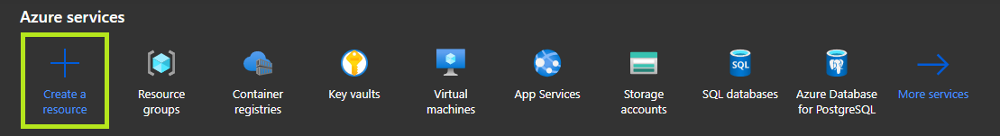
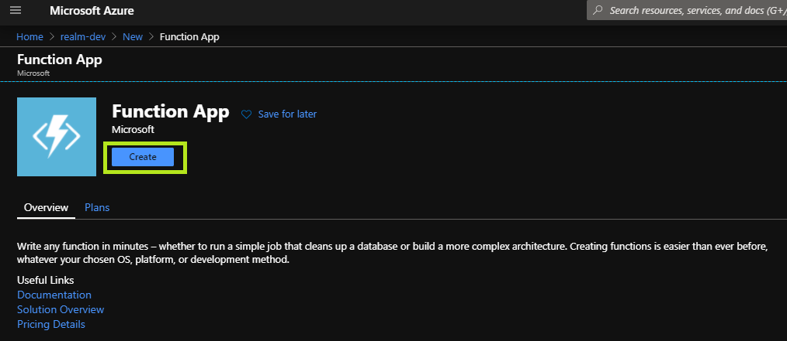
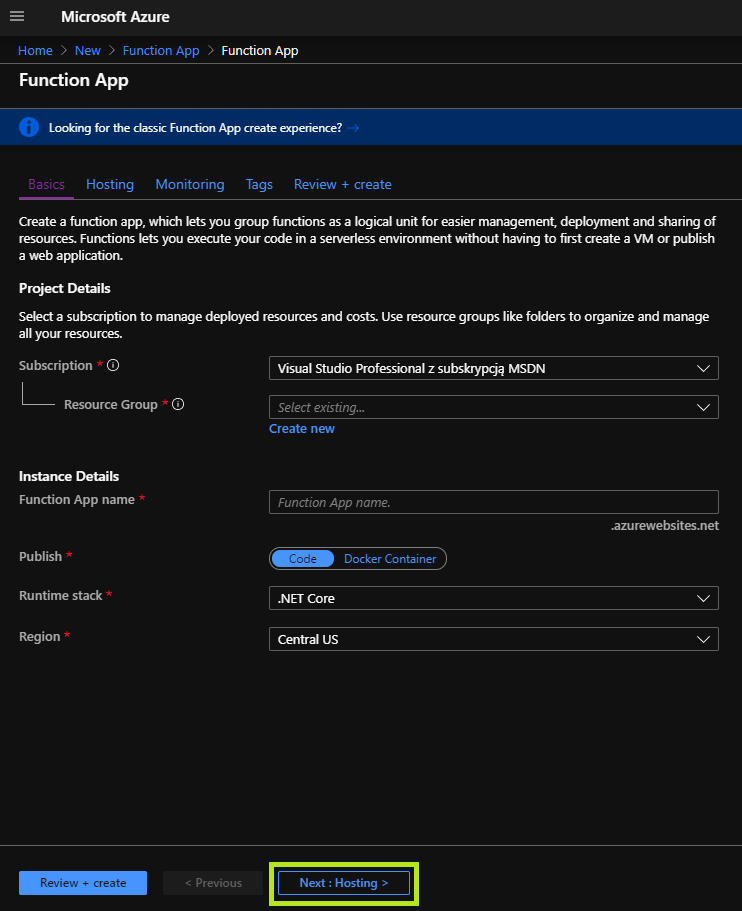
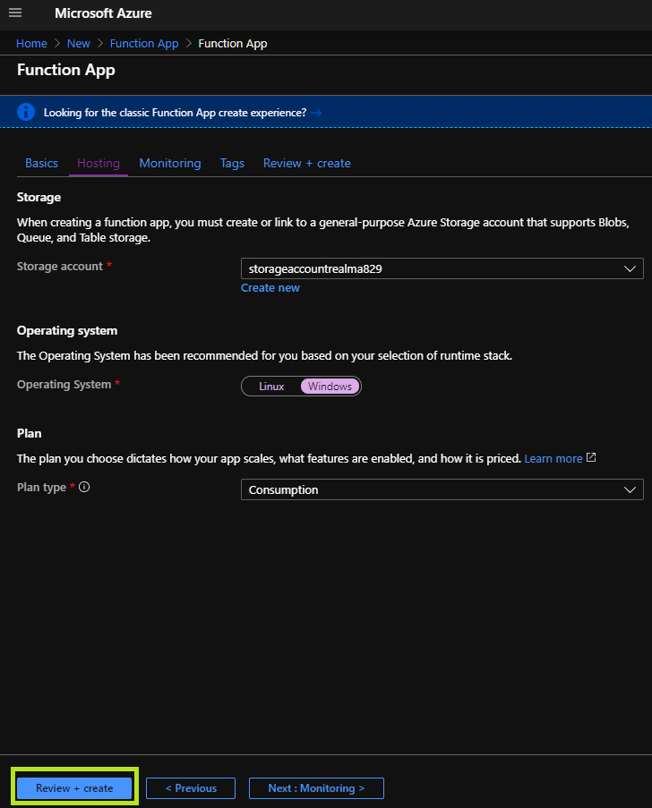
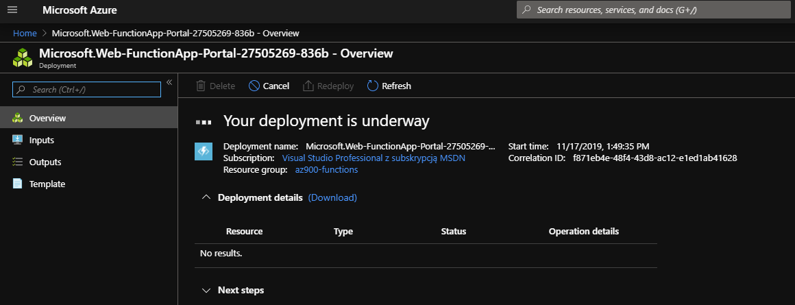
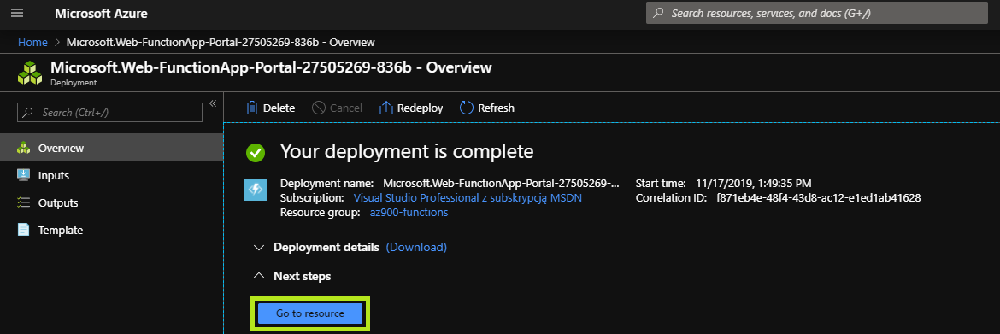

# Lab04 - Azure Functions

This lab aims to provide a hands-on experience in deploying an [Azure Functions App](https://azure.microsoft.com/en-us/services/functions/) with a HTTP trigger.

## About the exercise

The purpose of the exercise is to demonstrate the deployment of a simple Azure Function with a HTTP trigger

## Deployment

### Azure Portal (Manual)

> This method aims to deploy an functions instance using the Azure Portal

#### Azure Portal
    
- Sign in to the portal using the provided credentials.

#### Resource Group

- Create a dedicated resource group to host your azure container instance.

#### Create the Azure Functions App

- Select `Create a resource`.
- Search the Marketplace for `Container Instances`.
    
- Click `Create`.

#### Configure the Azure Function Basics

- `Resource group`: Ensure the recently created resource group is selected.
- `Function App name`: Provide a unique name
- `Publish`: Set to `Code`
- `Runtime stack`: Set to `.NET Core`
- `Region`: pick a region.
- Click `Next: Hosting`

#### Configure the Azure Function Hosting

- `Storage account`: Create a new storage account
- `Operating system`: Ensure `Windows` is selected
- `Plan type`: Ensure `Consumption` is selected
- Click `Review + create` and then `Create` after validation is successful.

#### The Functions App Resource deployment

*Function App deployment underway*

*Function App deployment completed*

- Wait for the resource deployment to complete successfully.
- Click `Go oto resource` when deployment is completed.

