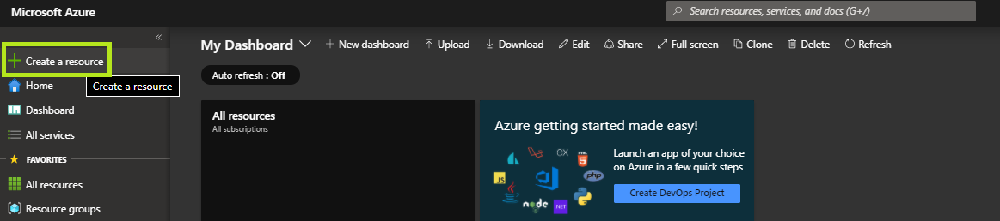
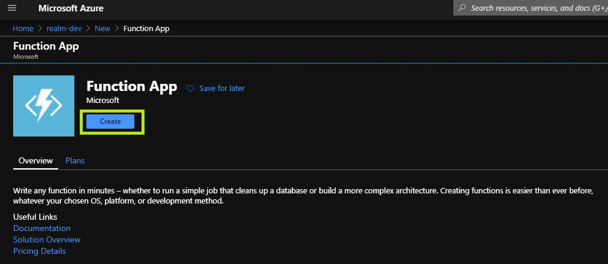
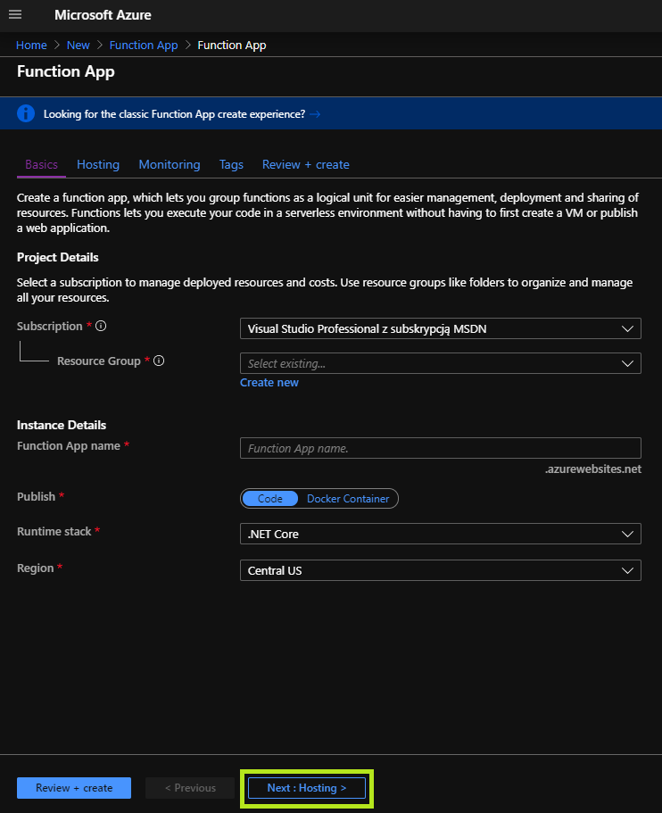
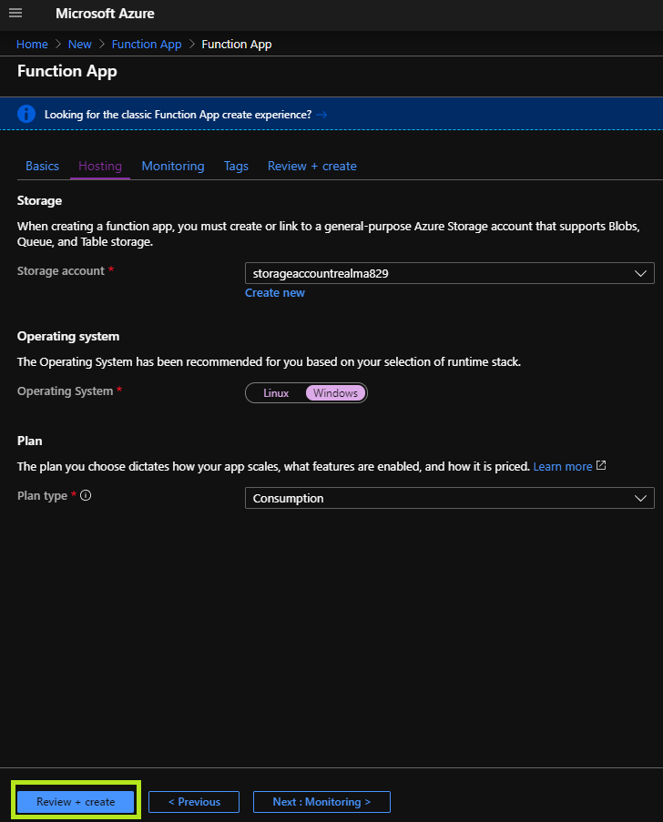
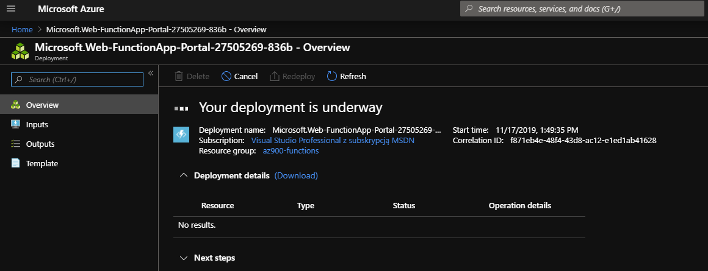
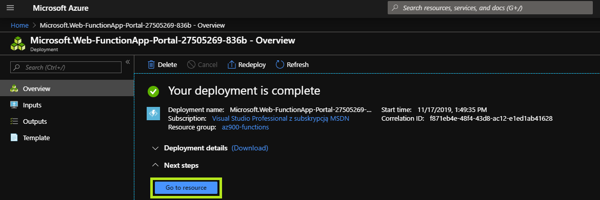

# Lab04 - Azure Functions - Deployment

## Deployment

### Azure Portal (Manual)

> This method aims to deploy an functions instance using the Azure Portal

#### Azure Portal
    
- Sign in to the portal using the provided credentials.

#### Resource Group

- Create a dedicated resource group to host your azure container instance.

#### Create the Azure Functions App

- Select `Create a resource`.
- Search the Marketplace for `Function App`.

> **Important:**
>
> When presented with the choice **do NOT** pick the `Function App (Classic)`

    
- Click `Create`.

#### Configure the Azure Function Basics

- **Resource group**: Ensure the `AZ900_user[i]_LAB04_RG` resource group is selected.
- **Function App name**: Provide a unique name
- **Publish**: Set to `Code`
- **Runtime stack**: Set to `.NET Core`
- **Region**: pick a region.
- Click `Next: Hosting`

#### Configure the Azure Function Hosting

- **Storage account**: Create a new storage account
- **Operating system**: Ensure `Windows` is selected
- **Plan type**: Ensure `Consumption` is selected
- Click `Review + create` and then `Create` after validation is successful.

#### The Functions App Resource deployment

*Function App deployment underway*

*Function App deployment completed*

- Wait for the resource deployment to complete successfully.
- Click `Go oto resource` when deployment is completed.

This concludes the first part of the exercise. Please proceed to the [next part](./http-function.md) of the exercise. 

