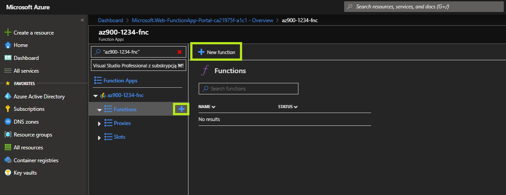
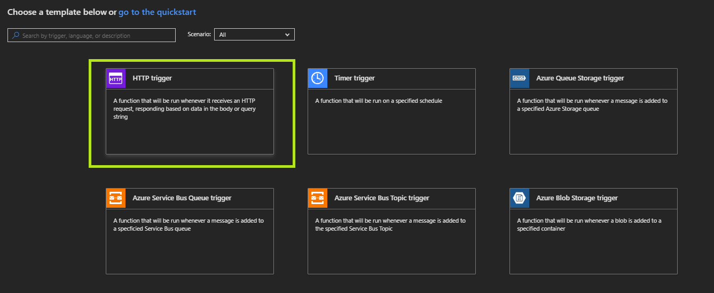
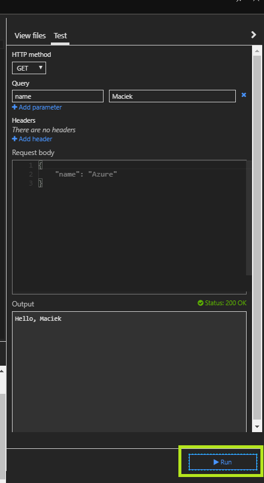
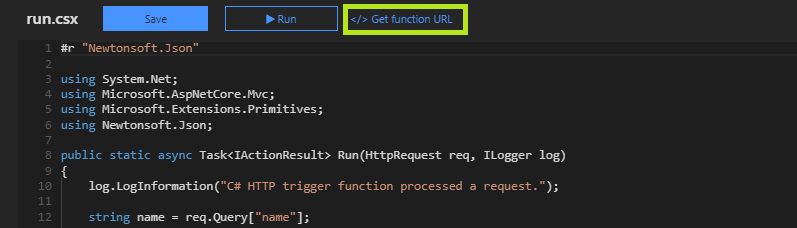

# Lab04 - Azure Functions - Creating a HTTP Trigger Function

## Creating a HTTP Trigger Function

### Azure Portal (Manual)

#### Azure Portal
    
- This part of the exercise assumes the [previous part](./deployment.md) of the exercise has been completed.

#### Create a new Function

- Expand the `Function Apps` tree
- Click the `+` button at the `Functions` node
- Click the `+ New function` button

#### Choose a template

- Select `HTTP Trigger` from the template list
- `Name`: set to default value
- `Authorization level`: ensure `Function` is selected
- Click `Create`

#### Run the function

- Click `Save`
- Click `Run

#### Test the function

In order to verify that the function is working we can test the HTTP endpoint it exposes. This can be achieved in multiple ways, using any HTTP client.

In this exercise we will test the function using the built-in portal functionality, next we will execute the same test using a regular web browser.

> **Expected result**
>
> Both tests are expected to produce the same result - a HTTP GET request, resulting in a HTTP 200 response, containing your name.

##### Azure Portal Test

- `HTTP Method`: ensure `GET` is selected
- `Query`:
    - Click `+ Add parameter`
    - Set the parameter name to: `name`
    - Set the parameter value to your first name
    - Click `Run`

##### Manual Test

- Click `</> Get function URL`
- Click `Copy` to copy the complete function URL to clipboard
- Open a new browser tab
- Paste the URL (Ctrl+V)
- Append `&name={your-name}`, use your first name to replace the `{your-name}` placeholder

> **Note**
>
> The resulting URL should resemble:
> - `https://{function-name}.azurewebsites.net/api/HttpTrigger1?code={function-code}&name={your-name}`
- Press ENTER and verify that the function works

> **Note**
>
> The above test can be replicated with any HTTP client, such as Postman, SoapUI, curl, `System.Net.HttpClient` etc.