# Lab05 - Azure Blob Storage

This lab aims to provide a hands-on experience in deploying an Azure Storage Account containing a Container with BLobs

## About the exercise

The purpose of the exercise is to demonstrate the deployment of a storage account, creation of a container and upload of a file to the blob storage

## Deployment

### Azure Portal (Manual)

> This method aims to deploy an ACI instance using the Azure Portal

#### Azure Portal

- Sign in to the portal using the provided credentials.
#### Resource Group

- The resource group dedicated for this lab is: `AZ900_user[i]_LAB05_RG`

#### Create the Storage Account
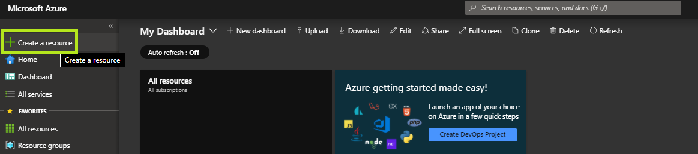
- Select `Create a resource`.
- Search the Marketplace for `Storage account`.
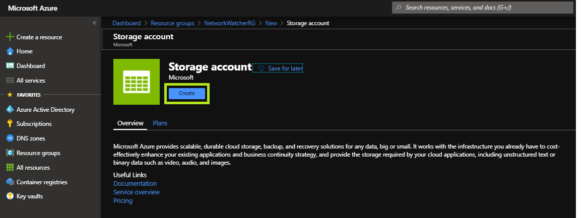
- Click `Create`.

#### Configure Storage Account Basics
 
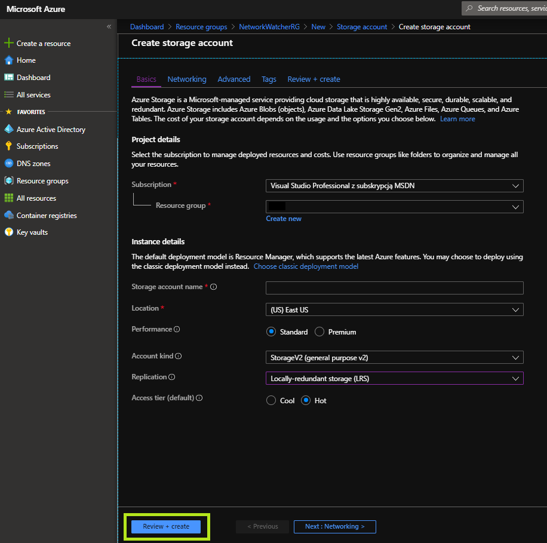
- **Resource group**: Ensure the `AZ900_user[i]_LAB05_RG` resource group is selected.
- **Storage account name**: set to a unique value.
- **Location**: pick a region.
- **Performance**: set to `Standard`
- **Account kind**: ensure `StorageV2` is set.
- **Replication**: set to `Locally-redundant storage (LRS)`.
- **Access tier**: set to `Hot`
- Click `Review + create` and then `Create` after validation is successful.

#### The Storage Account deployment
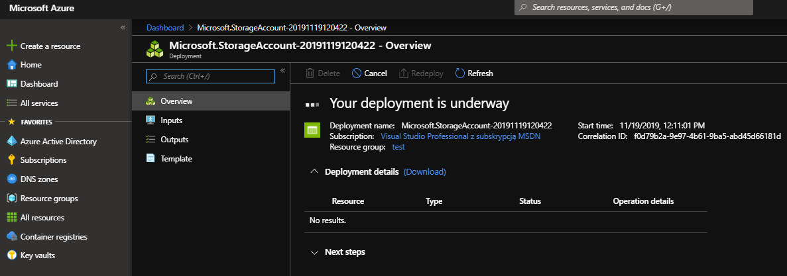
*Storage account deployment underway*

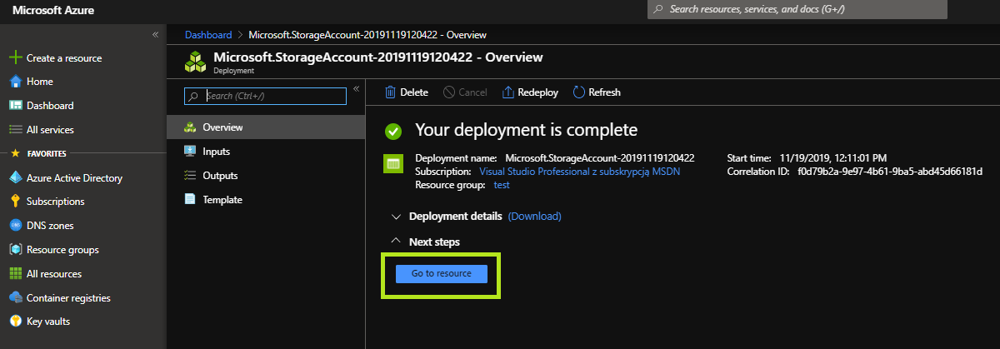
*Storage account deployment completed*
- Wait for the resource deployment to complete successfully.
- Click `Go oto resource` when deployment is completed.

#### The Container Creation

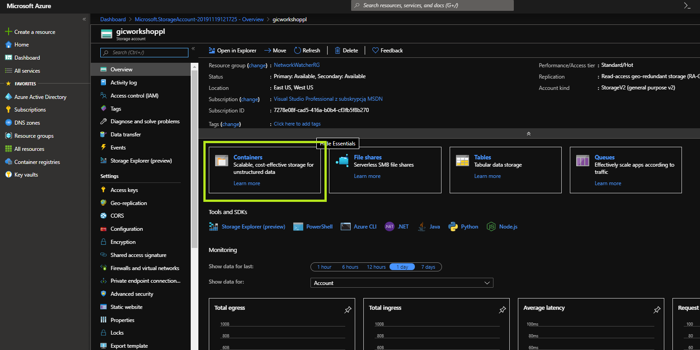
- Click on `Containers`

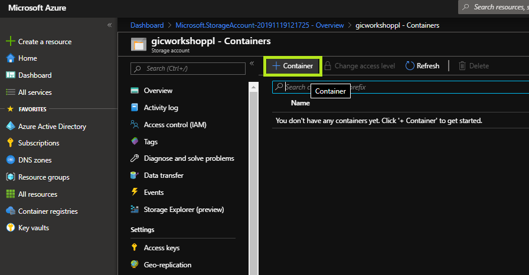
- Click on `+ Container`

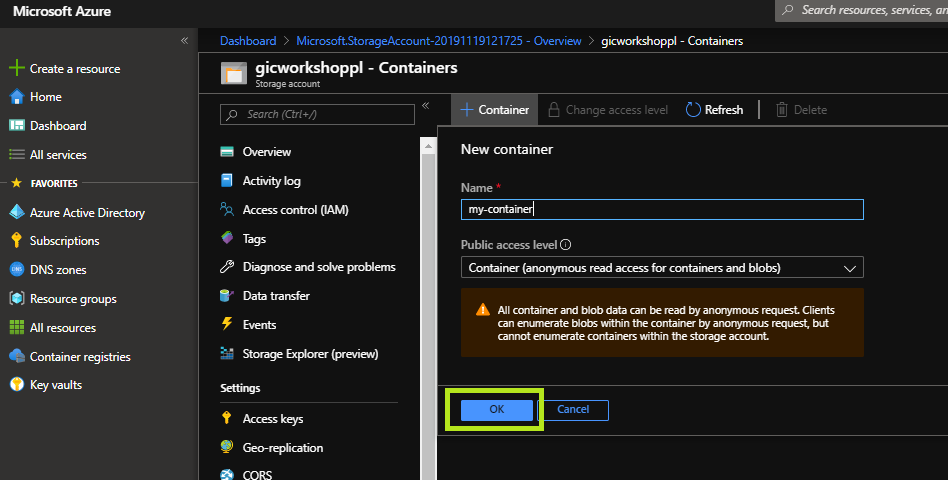
- **Name**: set to `images`
- **Public access level**: set to `Container`
- Ignore the warning
- Click on `Ok`
- Wait for the container creation to complete
- Click on the newly created container

#### File upload to Blob
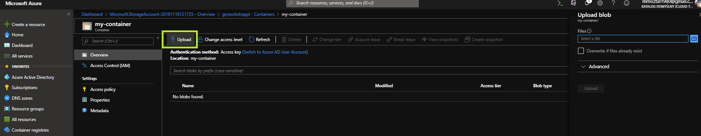
- Click on `Upload`
- Right-hand side flyout-menu will appear

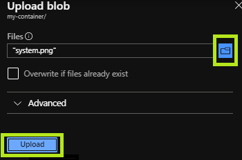
- Click on the folder icon
- Select an image to upload
- Wait for `Upload` to become accessible
- Click on `Upload`
- Click on the newly uploaded file

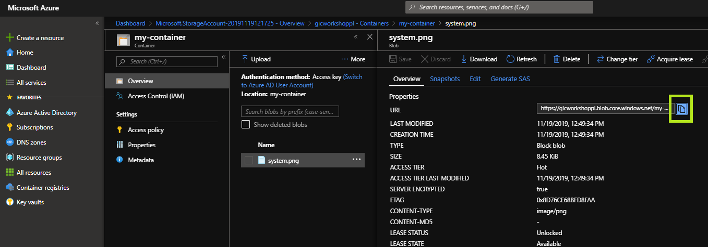
- Click on the copy button to copy the img URL to clipboard
- Open a new tab in your browser
- Paste the image URL and press ENTER
- The image should be accessible from a public blob

## Clean up
Now simply delete resource LAB05 resource group.
